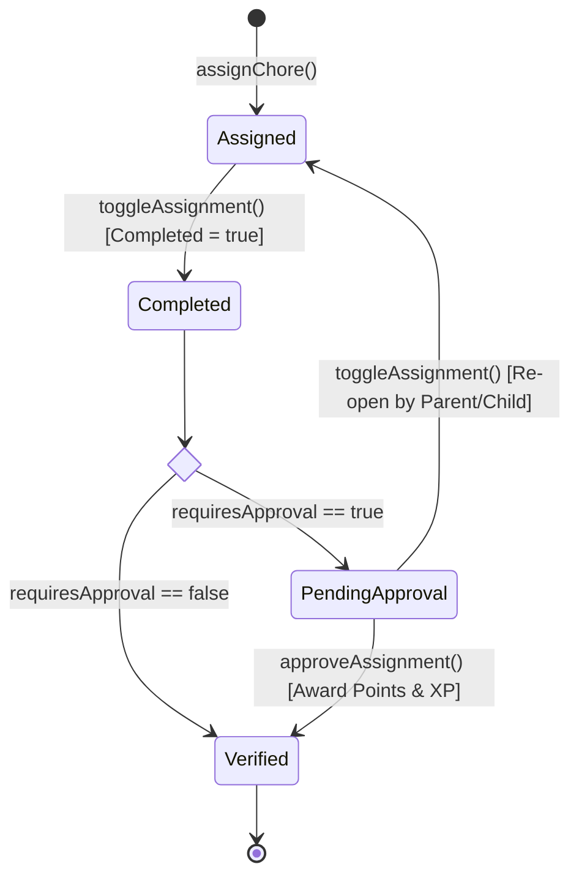
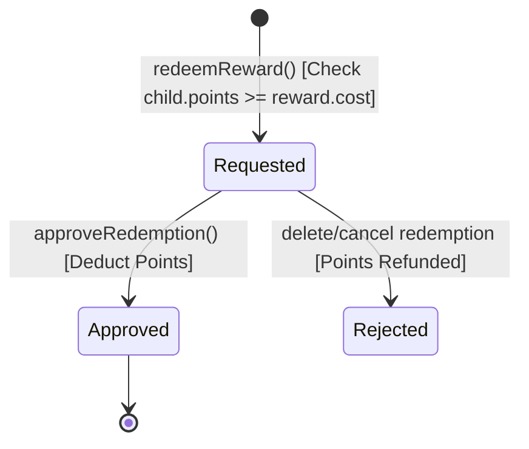

# Specification: Domain Model & Ubiquitous Language

**Specification Version:** 1.0.0  
**Project:** ChoreQuest  
**Status:** Active  

---

## 1. Ubiquitous Language

| Term | Definition |
| :--- | :--- |
| **Profile** | A family member entity. Can be a `child` (earns XP, completes quests) or `parent` (manages chores, approves submissions). |
| **Chore** | A task template defined by a title, description, category, point value, recurrence, and optional approval requirement. |
| **Assignment** | An active instance of a Chore linked to a specific Child Profile with completion status and timestamps. |
| **Reward** | A redeemable perk or prize defined by title, cost in points, icon, and active status. |
| **Redemption** | A transaction request where a Child spends points to acquire a Reward, pending Parent approval. |
| **Family** | A cloud sync boundary linking multiple devices under a shared UUID (`family_id`). |
| **Sync Operation** | A queued mutation record containing action (`insert`, `update`, `delete`), payload, and target table for offline replay. |

---

## 2. Entity Schemas & TypeScript Definitions

### 2.1 Profile Entity (`Profile`)
```typescript
interface Profile {
  id: string;             // UUID
  name: string;           // Display Name
  avatar: string;         // Dicebear avatar key / URL
  role: 'child' | 'parent';
  points: number;         // Current spendable currency balance
  xp: number;             // Lifetime total experience points
  level: number;          // Calculated level: floor(xp / 100) + 1
  badges: string[];       // Unlocked achievement badge IDs
}
```

### 2.2 Chore Entity (`Chore`)
```typescript
interface Chore {
  id: string;             // UUID
  title: string;          // Quest title
  description: string;    // Instructions / details
  icon: string;           // Lucide icon key
  points: number;         // XP / Point reward value
  category: 'cleaning' | 'learning' | 'health' | 'family' | 'pets';
  recurrence: 'daily' | 'weekly' | 'custom';
  requiresApproval: boolean; // Requires Parent verification before points awarded
  status: 'active' | 'archived';
}
```

### 2.3 Assignment Entity (`Assignment`)
```typescript
interface Assignment {
  id: string;             // UUID
  choreId: string;        // Ref: Chore.id
  childId: string;        // Ref: Profile.id
  completed: boolean;     // Toggle state
  completedAt?: string;   // ISO timestamp
  verifiedAt?: string;    // ISO timestamp when Parent approved
  createdAt: string;      // ISO timestamp
}
```

### 2.4 Reward & Redemption Entities (`Reward`, `Redemption`)
```typescript
interface Reward {
  id: string;             // UUID
  title: string;
  cost: number;           // Points required
  icon: string;
  category: 'privilege' | 'item' | 'activity';
  status: 'active' | 'archived';
}

interface Redemption {
  id: string;             // UUID
  rewardId: string;       // Ref: Reward.id
  childId: string;        // Ref: Profile.id
  pointsSpent: number;
  approved: boolean;      // Parent verification
  redeemedAt: string;     // ISO timestamp
}
```

---

## 3. State Machine Transitions

### 3.1 Chore Assignment Lifecycle



### 3.2 Reward Redemption Lifecycle


